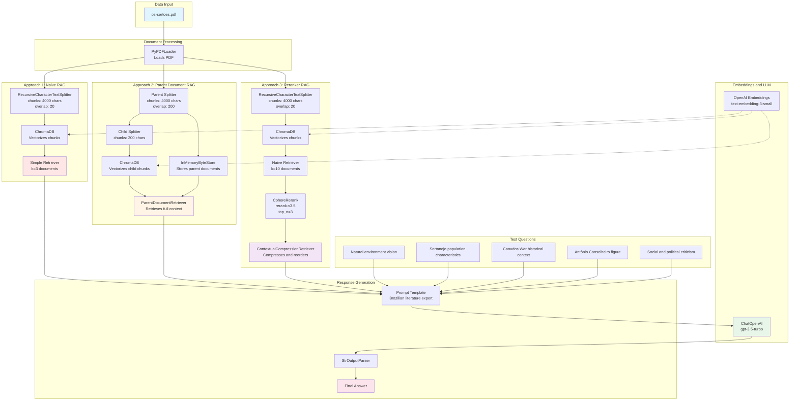

# Os Sertões - RAG System (Retrieval-Augmented Generation)

## 📖 About the Project

This project implements a **RAG (Retrieval-Augmented Generation)** system for analyzing and querying the classic Brazilian literary work "Os Sertões" by Euclides da Cunha. The system uses advanced natural language processing and information retrieval techniques to answer questions about the work in a contextualized and accurate manner.

## Objective

Create an intelligent assistant capable of answering questions about "Os Sertões" using three different RAG approaches:
- **Naive RAG**: Simple vector similarity retrieval
- **Parent Document Retriever**: Hierarchical document retrieval
- **Reranker RAG**: Retrieval with result reordering using Cohere

## System Architecture



## 📊 Approach Comparison

### Naive RAG (`naive_rag.ipynb`)

**Characteristics:**
- **Simple Chunking**: Divides documents into 4000-character chunks with 20-character overlap
- **Direct Retrieval**: Retrieves the 3 most similar documents based on vector similarity
- **Advantage**: Simple, fast, and easy to implement
- **Storage**: ChromaDB for vectors only

**Flow:**
1. Loads PDF and splits into chunks of 4000 characters
2. Stores chunks in ChromaDB
3. On query, retrieves the 3 most similar documents
4. Passes context directly to the LLM

### Parent Document RAG (`parent_rag.ipynb`)

**Characteristics:**
- **Hierarchical Chunking**: Divides documents into large chunks (parents) and small chunks (children)
- **Child Chunks**: 200 characters - used for vector search
- **Parent Chunks**: 4000 characters with 200-character overlap - returned as context
- **Advantage**: Precise search with broad context
- **Storage**: InMemoryByteStore for parent documents + ChromaDB for vectors

**Flow:**
1. Loads PDF and splits into pages
2. Creates parent chunks (4000 chars) and child chunks (200 chars)
3. Stores child chunks in ChromaDB for vector search
4. Stores parent chunks in InMemoryByteStore
5. On query, searches for the most relevant child chunks
6. Returns the corresponding parent chunks as context

### Reranker RAG (`reranker_rag.ipynb`)

**Characteristics:**
- **Simple Chunking**: Divides documents into 4000-character chunks with 20-character overlap
- **Two-Stage Retrieval**:
  1. Naive Retriever: Searches for the 10 most similar documents
  2. Cohere Rerank: Reorders and selects the top 3
- **Advantage**: Better precision through semantic reordering
- **Rerank Model**: Cohere rerank-v3.5

**Flow:**
1. Loads PDF and splits into 4000-character chunks
2. Stores chunks in ChromaDB
3. On query, retrieves 10 candidate documents
4. Uses Cohere Rerank to reorder and select the top 3
5. Passes compressed context to the LLM

## 🛠️ Technologies Used

- **LangChain**: Framework for developing applications with LLMs
- **OpenAI GPT-3.5-turbo**: Language model for response generation
- **OpenAI Embeddings**: Vector embedding generation
- **ChromaDB**: Vector database
- **Cohere Rerank**: Semantic reordering model
- **PyPDF**: PDF text extraction
- **Python 3.12**: Programming language

## Installation

### Prerequisites

```bash
sudo apt update
sudo apt install python3.12-venv
```

### Environment Setup

```bash
# Create virtual environment
python3 -m venv .venv

# Activate virtual environment
source .venv/bin/activate

# Install dependencies
pip install -r requirements.txt
pip install ipykernel
```

### Environment Variables

Create a `.env` file in the project root with the following keys:

```env
OPENAI_API_KEY=your_openai_key
COHERE_API_KEY=your_cohere_key
```

## 🚀 How to Use

### 1. Naive RAG

Open the `naive_rag.ipynb` notebook and execute the cells sequentially:

```python
# The notebook will:
# 1. Load the PDF "os-sertoes.pdf"
# 2. Create a simple retrieval system
# 3. Answer 5 questions about the work
```

### 2. Parent Document RAG

Open the `parent_rag.ipynb` notebook and execute the cells sequentially:

```python
# The notebook will:
# 1. Load the PDF "os-sertoes.pdf"
# 2. Create a hierarchical retrieval system
# 3. Answer 5 questions about the work
```

### 3. Reranker RAG

Open the `reranker_rag.ipynb` notebook and execute the cells sequentially:

```python
# The notebook will:
# 1. Load the PDF "os-sertoes.pdf"
# 2. Create a retrieval system with reranking
# 3. Answer the same 5 questions for comparison
```

## 📝 Test Questions

The system was tested with the following questions:

1. What is Euclides da Cunha's vision of the natural environment of the northeastern sertão and how does it influence the lives of the inhabitants?
2. What are the main characteristics of the sertanejo population described by Euclides da Cunha? How does he relate these characteristics to the environment in which they live?
3. What was the historical and political context that led to the Canudos War, according to Euclides da Cunha?
4. How does Euclides da Cunha describe the figure of Antônio Conselheiro and his role in the Canudos War?
5. What are the main aspects of social and political criticism present in "Os Sertões"? How do these aspects reflect the author's vision of Brazil at the time?

## 🔍 Technical Details

### LLM Configuration

- **Model**: gpt-3.5-turbo
- **Max Tokens**: 200 (Naive and Parent RAG) / 500 (Reranker RAG)
- **Temperature**: Default

### Chunking Configuration

**Naive RAG:**
- Chunks: 4000 characters, overlap 20
- Retrieval: Top 3 documents

**Parent Document RAG:**
- Parent chunks: 4000 characters, overlap 200
- Child chunks: 200 characters

**Reranker RAG:**
- Chunks: 4000 characters, overlap 20
- Retrieval: Top 10 → Rerank to Top 3

## 📄 Project Structure

```
Os-Sertoes-RAG/
├── os-sertoes.pdf           # Source document
├── naive_rag.ipynb          # Naive RAG implementation
├── parent_rag.ipynb         # Parent Document RAG implementation
├── reranker_rag.ipynb       # Reranker RAG implementation
├── requirements.txt         # Project dependencies
├── makefile                 # Installation commands
├── .env                     # Environment variables (not versioned)
├── LICENSE                  # Project license
└── README.md               # This file
```

## 🎓 Applied Concepts

- **RAG (Retrieval-Augmented Generation)**: Technique that combines information retrieval with text generation
- **Embeddings**: Vector representation of text for semantic search
- **Chunking**: Division of documents into smaller parts for processing
- **Reranking**: Reordering of results to improve relevance
- **Vector Database**: Efficient storage and search of embeddings
- **Hierarchical Retrieval**: Multi-level document retrieval strategy

## 📊 Results

All three approaches were able to answer the questions with relevant context from "Os Sertões". The choice between them depends on the use case:

- **Naive RAG**: Best for simple use cases, fast responses, and when computational resources are limited
- **Parent Document RAG**: Best for broader contexts and detailed answers with precise retrieval
- **Reranker RAG**: Best for maximum precision and relevance with focused context

## 🔬 Performance Comparison

| Approach | Retrieval Speed | Context Quality | Precision | Complexity |
|----------|----------------|-----------------|-----------|------------|
| Naive RAG | ⚡⚡⚡ Fast | ⭐⭐ Good | ⭐⭐ Good | 🔧 Low |
| Parent Document RAG | ⚡⚡ Medium | ⭐⭐⭐ Excellent | ⭐⭐⭐ Excellent | 🔧🔧 Medium |
| Reranker RAG | ⚡ Slower | ⭐⭐⭐ Excellent | ⭐⭐⭐⭐ Outstanding | 🔧🔧🔧 High |

## 📜 License

This project is licensed under the terms specified in the LICENSE file.

## 🤝 Contributions

Contributions are welcome! Feel free to open issues or pull requests.
